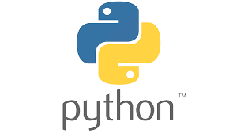
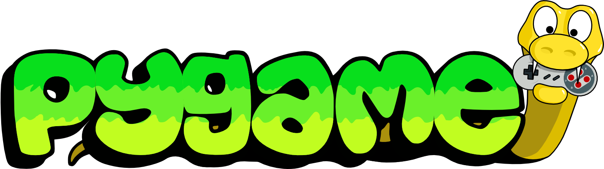
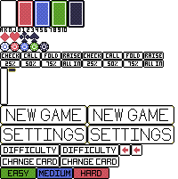
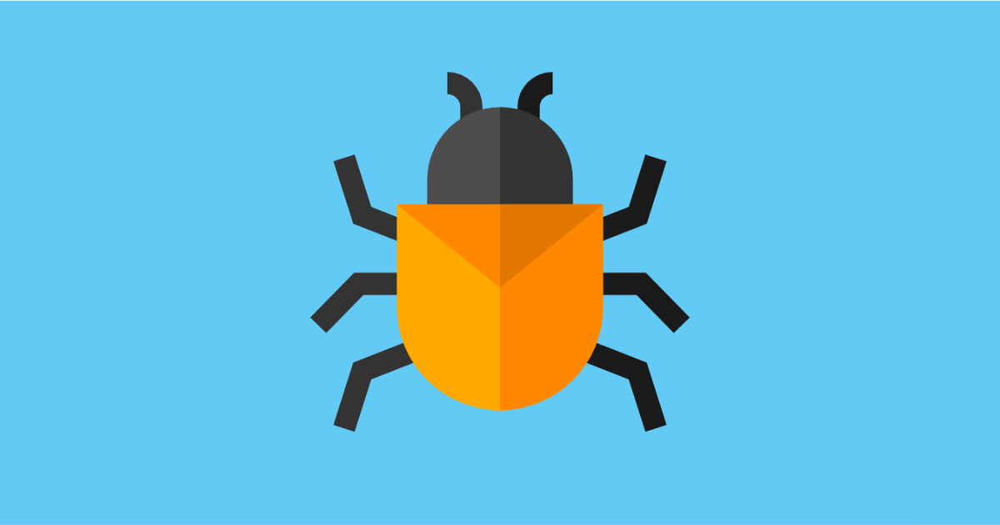

# Heads Up Poker

## Software Engineering Final Project

---

```
src/
├── main.py
├── models/
│   └── ml_cpu_model.pkl
├── game_engine/
│   ├── engine.py
│   ├── cpu/
│   │   ├── mlCPU.py
│   │   ├── potOddsCPU.py
│   │   ├── expectedValueCPU.py
│   │   ├── equityCPU.py
│   │   └── baselineCPU.py
│   ├── hand_evaluator.py
│   ├── dealer.py
│   ├── betting_manager.py
│   ├── player.py
│   ├── game_evaluator.py
│   ├── table.py
│   ├── card.py
│   ├── pot.py
│   ├── deck.py
│   └── constants.py
└── gui/
    ├── button.py
    ├── util.py
    ├── spritetext.py
    ├── gui_card.py
    ├── slider.py
    ├── numtext.py
    └── chip.py
```

---

# Core Game Engine

- **Core Game Engine**
  - Python-based poker implementation
  - Supports Texas Hold'em rules
  - Multiple CPU difficulty levels
  - Hand evaluation and game state management
  

---

# GUI Implementation

- **GUI Implementation**
  - Pygame-based interface
  - Visual card and chip representations
  - Interactive betting controls
  - Real-time game state updates
 
  

---

# Code Overview

- **Game Engine Components**
  - `Engine`: Core game logic and state management
  - `Dealer`: Handles card dealing and round progression
  - `BettingManager`: Handles betting logic
  - `Player`: Base player class with action handling
  - `GameEvaluator`: Handles game evaluation and winner determination
  - `HandEvaluator`: Handles hand evaluation
---

# Code Overview Continued
- **Game Engine Components**
  - `CPU`: Multiple AI implementations (Baseline, Equity, Pot Odds, ML)
  - `Deck`: Handles card deck management
  - `Pot`: Handles pot management
  - `Table`: Handles table management
  - `Card`: Handles card management

---

# GUI Implementation

- **GUI Components**
  - `Button`: Interactive UI elements
  - `GUI_Card`: Visual card representation
  - `Chip`: Visual chip stack representation
  - `Slider`: Betting amount control
  - `NumText`: Number display
  - `SpriteText`: Text rendering
  - `Util`: Utility functions

  

---

# Live Demo

- **Game Flow**
  1. Start new game
  2. Place blinds
  3. Deal cards
  4. Betting rounds
  5. Showdown
  6. Winner determination

- **Features to Show**
  - Different CPU difficulties
  - Betting mechanics
  - Hand evaluation
  - Visual feedback

---
# Known Bugs and Implementation Errors

- **Bugs**
  - CPU turn not fully updating 
  - Spam click button causes crash
  - Changing difficulty does not start a new game 



- **Misimplementation** 
  - Bet percentage in relation to user hands versus game pot
  - Doesn't clearly show big or large blind 
  - User player always goes first at start of game 


---

# Work Division

- **GUI** (James/Nathan)
  - Game engine core implementation
  - CPU AI development
  - Testing GUI

- **Engine** (Conor/Surya)
  - Game engine core implementation
  - CPU AI development
  - Testing (Pytest)

---

# Shared Responsibilities

- **Shared Responsibilities**
  - Code review
  - Documentation
  - Bug fixing
  - Testing
  - Communicating 

---

# Git Usage

- **Branch Strategy**
  - `main`: Production-ready code
  - Feature branches for new implementations

- **Commit Practices**
  - Small, frequent commits
  - Update documentation/tests with new features
  - Regular pushes
  - Pull request reviews

---

# Collaboration

- **Collaboration**
  - Code review process
  - Feature discussions
- **Tools**
  - Trello: Task Organization 
  - Slack: Team Communication


---

# What Worked Well

- **Technical Successes**
  - Clean architecture separation
    - Good seperation between engine and GUI
    - Modular CPU implementations
  - Interactive GUI

- **Process Successes**
  - Regular communication
  - Clear task division
  - Comprehensive testing
  - Async working worked well (slack)
  - Meetings were directed and quick 


---

# Challenges Faced

- **Technical Challenges**
  - ML CPU training stability
  - GUI performance optimization
  - Engine code more complex then it needed to be for 1v1
    - Making code more scalable cost time
  - Edge case handling


- **Process Challenges**
  - Documentation maintenance
  - Feature prioritization
  - Sprint #1: should start making features (even if small)
  - Unclear task seperation
  

---

# Lessons Learned

- **Technical Improvements**
  - Better error handling
  - More comprehensive testing
  - Performance optimization
  - Test's could be more "DRY"

- **Process Improvements**
  - More frequent reviews
  - Better task estimation
  - Enhanced communication

---

# Future Enhancements

- **Technical Features**
  - Multiplayer support
  - Tournament mode
  - Advanced AI strategies
  - Visually show hand (highlight cards), when player wins a hand  

- **Process Improvements**
  - Automated testing
    - e2e testing? 
  - Performance monitoring
  - User feedback system

---

# Questions?

Thank you for your attention!
